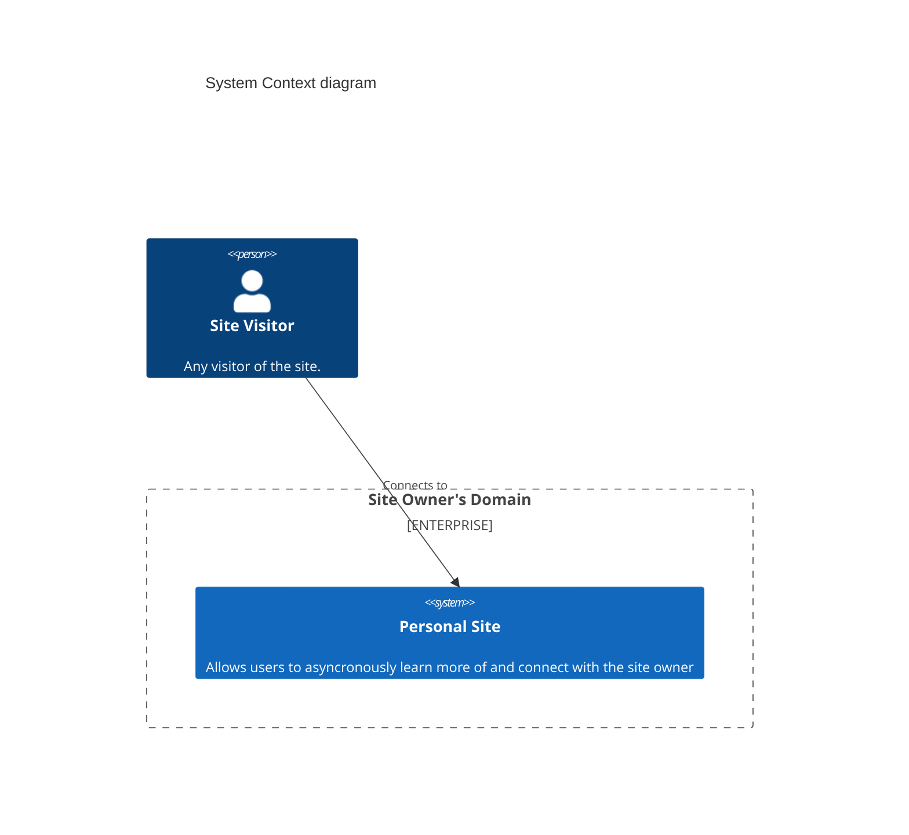
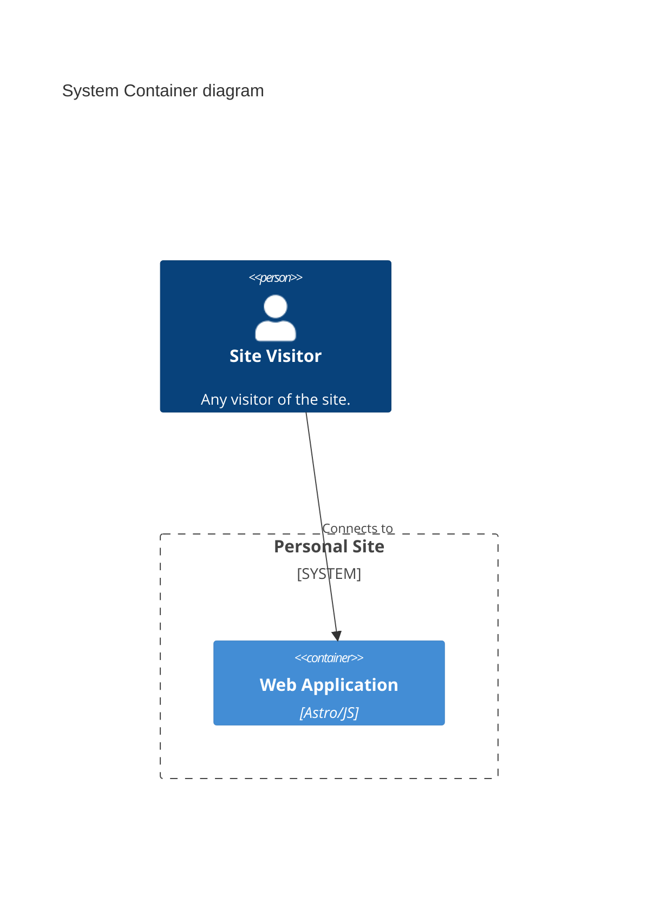

The site consists of a single deployment.

```mermaid
  C4Context
    title System Context diagram
    Person(sv, "Site Visitor", "Any visitor of the site.")

    Enterprise_Boundary(so, "Site Owner's Domain", "Boundary of the site owner") {
      System(site, "Personal Site", "Allows users to asyncronously learn more of and connect with the site owner")
    }

    Rel(sv, site, "Connects to")
```

```mermaid
  C4Container
    title System Container diagram
    Person(sv, "Site Visitor", "Any visitor of the site.")

    System_Boundary(site, "Personal Site") {
      Container(webapp, "Web Application", "Astro/JS")
    }

    Rel(sv, webapp, "Connects to")
```
