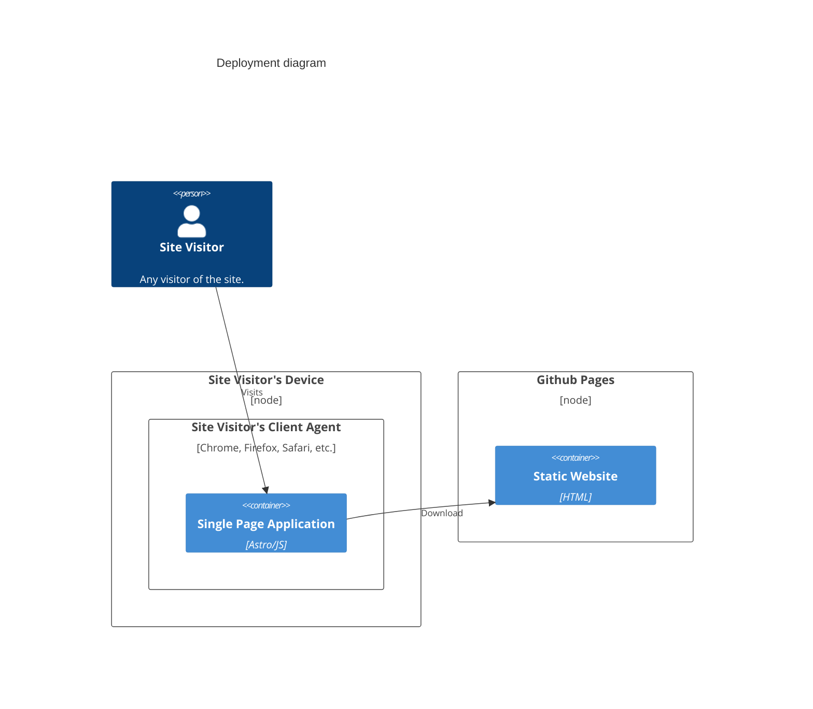

The site is deployed to Github Pages as a static webpage, rendered by site visitor's device.

```mermaid
  C4Deployment
    title Deployment diagram
    Person(sv, "Site Visitor", "Any visitor of the site.")

    Deployment_Node(device, "Site Visitor's Device") {
      Deployment_Node(agent, "Site Visitor's Client Agent", "Chrome, Firefox, Safari, etc.") {
        Container(spa, "Single Page Application", "Astro/JS")
      }
    }

    Deployment_Node(github, "Github Pages") {
      Container(website, "Static Website", "HTML")
    }

    Rel(sv, spa, "Visits")
    Rel(spa, website, "Download")
```
