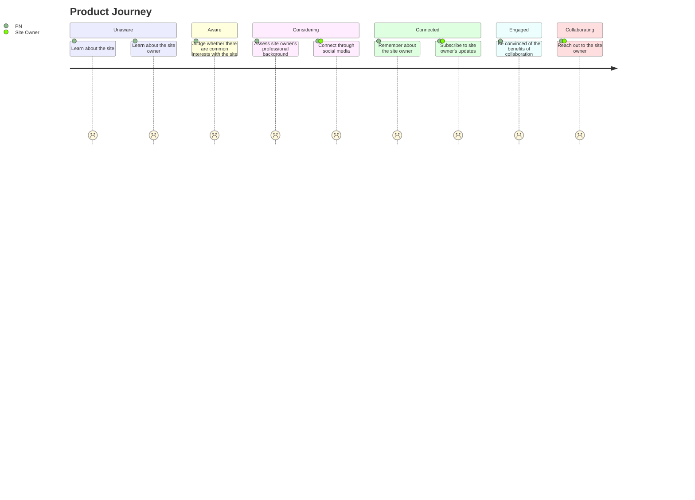

This site is a personal website.
As such, it aims to provide a clear understanding of the site owner's professional experience, interests and findings.

## Ultimate Goal

The site MUST expand the site owner's **professional network** and grow an active portion of it, willing to **collaborate**.

## Quality Goals

The following quality goals are prioritized in terms of architecture of the solution.

**Flexible**. The site MUST be adaptable to change and therefore investments in clarity and simplicity of the code and/or setup are prioritized.

**Efficient**. The site MUST require minimal resources to maintain.

**Operable**. The site MUST be observable and require minimal effort to run it.

## Product Strategy

The site is an **asyncronous** means of communication and connection.
At the same time, it allows **in depth** analysis of the site owner's professional background through a detailed and structured journey.
Additionally, it serves as an **engineering showcase**.

## Product Vision

For the members of site owner's professional network who wish to assess the site owner, this site is means to asynchronously study the site owner's detailed professional background, approach to engineering by this site's example and connect with them, unlike formats like Linkedin and CV that focus on brief summaries of the professional background.

Based on the structure of above journey, product requirements for the site are formed to help the target audience complete this journey.

Additionally, product and quality requirements can be based on the [stakeholders'](./stakeholders/) concerns.
