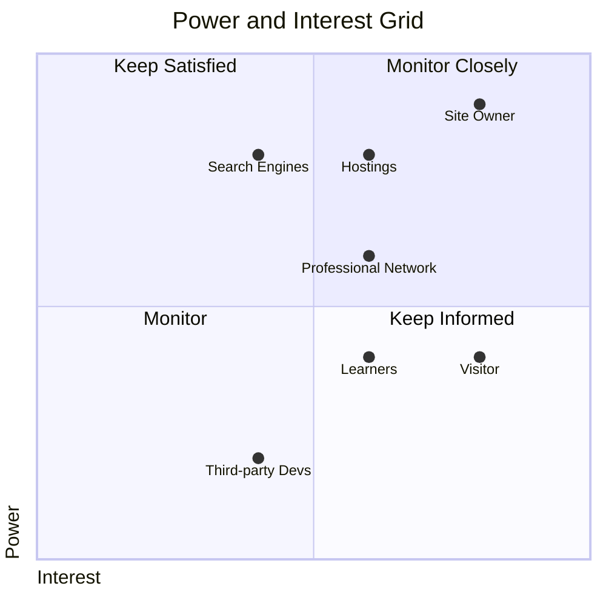

import { LinkCard, CardGrid } from '@astrojs/starlight/components'
import { Tabs, TabItem } from '@astrojs/starlight/components'

This page defines the stakeholders' identification format, criteria for stakeholder identification, and lists the identified stakeholders.

## Format

Each stakeholder will be presented in the following format:

- **Title**: A short, recognizable title for the stakeholder.
- **Overview**: A brief summary detailing who the stakeholder is or what role they play.
- **Goals**: The primary objectives the stakeholder hopes to achieve with respect to the system.
- **Interest**: An assessment of the stakeholder's level of interest in the project outcomes. This can be categorized (e.g., High, Medium, Low) according to later explanation.
- **Power**: An assessment of the stakeholder's ability to affect project decisions or outcomes. This can be categorized (e.g., High, Medium, Low) according to later explanation.

## Criteria for Identification

Stakeholders are identified and included in this list when:

- They MUST have a direct or indirect interest or stake in the system.
- They SHOULD have specific high-level objectives or interests that the system aims to address.
- They MAY be individuals, groups, or entities, internal or external to the project.

## Interest Rating

Interest reflects influence of the project results on the stakeholders.

0. **No Interest.** No stake in the project's outcome; indifferent to project results.
1. **Minimal Interest.** Has a slight stake or curiosity but is not significantly affected by the project's outcome.
2. **Low Interest.** Has some stake in the project but is not a primary beneficiary or impacted party.
3. **Moderate Interest.** Regularly engages with the project and its outcomes, but not a major driving force or beneficiary.
4. **High Interest.** Has a significant stake in the project's outcome; can be greatly affected by the project's success or failure.
5. **Absolute Interest.** Entirely dependent on the project's success; project outcomes can have critical consequences for them.

## Power Rating

Power rating is a measure of influence on decision making process.

0. **No Power.** Cannot sway or inform any decisions related to the project.
1. **Minimal Power.** Can provide minor insights or feedback but generally overlooked in decision-making.
2. **Low Power.** Can offer valuable input and might occasionally affect choices, but typically in collaboration with stronger influencers.
3. **Moderate Power.** Regularly consulted for opinions or advice; their insights often shape decisions, though not always.
4. **High Power.** Their opinions and feedback are highly sought after; they play a pivotal role in guiding decisions, with only a few exceptions.
5. **Absolute Power.** Their perspective is paramount; when they speak, the decision-makers listen intently and often follow their guidance.

## Identified Stakeholders

<CardGrid>
  <LinkCard title="Site Owner" href="./owner/" description="Owner and developer of the site (4, 5)" />
  <LinkCard title="Visitors" href="./visitors/" description="Main users of the site (4, 2)" />
  <LinkCard title="Professional Network" href="./professionals/" description="Members of professional circle (3, 3)" />
  <LinkCard title="Learners" href="./learners/" description="Inspiration and knowledge seekers (3, 2)" />
  <LinkCard title="Search Engines" href="./bots/" description="Search enginers and ranking bots (2, 4)" />
  <LinkCard title="Hostings" href="./hostings/" description="Hosting Service Providers (3, 4)" />
  <LinkCard title="Third Party Devs" href="./3dpdevs/" description="Third Part Software Developers (2, 1)" />
</CardGrid>

### Prioritization

## Intentionally Unaddressed Stakeholders

This clause defines considered stakeholders, however, not addressed as part of this document.

<Tabs>
  <TabItem label="Content Contributors or Guest Posters">
    The site is intended to have a single contributor in order to be demonstration of skills, knowledge and experience.
    External contributions are not expected at the moment of the decision.
  </TabItem>
  <TabItem label="Advertisers or Sponsors">
    The site is intended to be ads-free and sponsor-free at the moment of the decision.
  </TabItem>
</Tabs>
