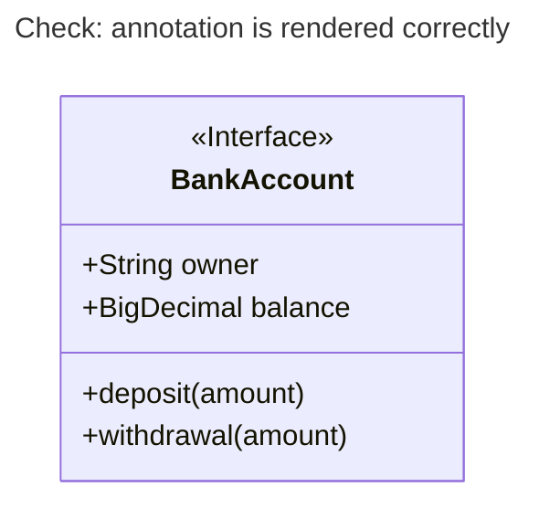
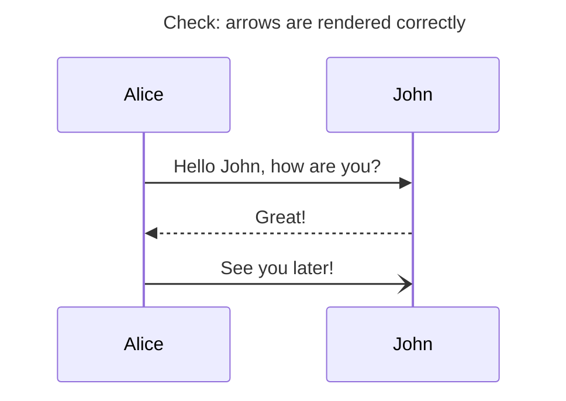

:::note

This is a hidden test page to validate mermaid integration.

:::

## Class Diagram

```mermaid
---
title: "Check: annotation is rendered correctly"
---
classDiagram
class BankAccount{
  <<Interface>>
  +String owner
  +BigDecimal balance
  +deposit(amount)
  +withdrawal(amount)
}
```

## Sequence Diagram

```mermaid
---
title: "Check: arrows are rendered correctly"
---
sequenceDiagram
    Alice->>John: Hello John, how are you?
    John-->>Alice: Great!
    Alice-)John: See you later!
```
